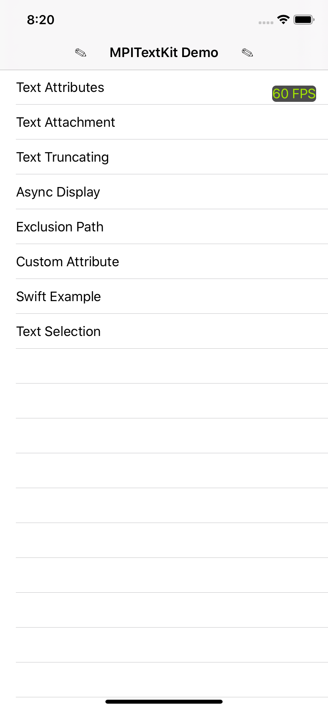
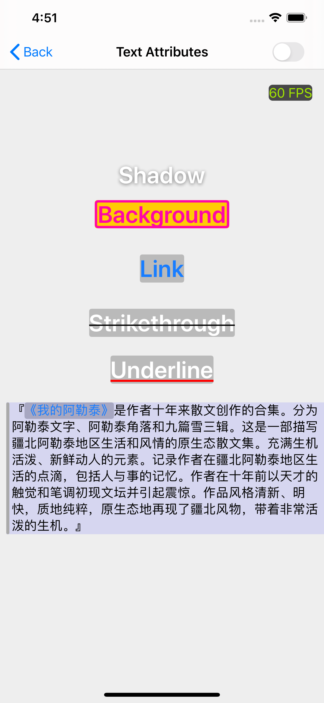
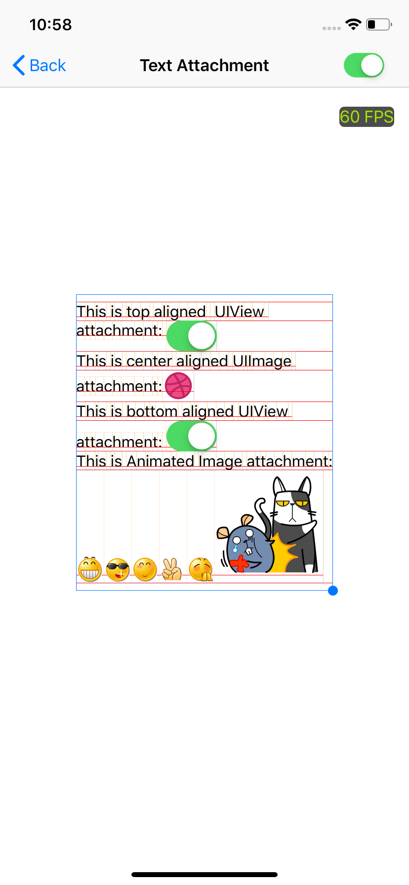
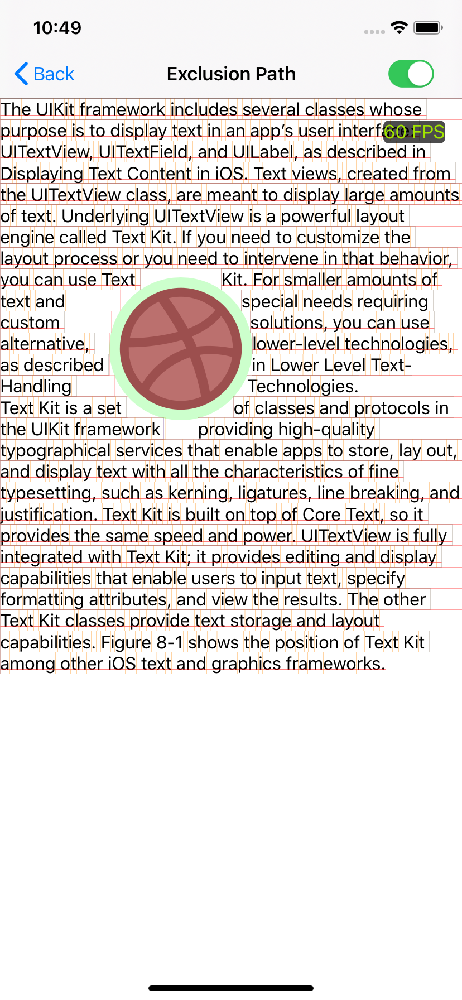
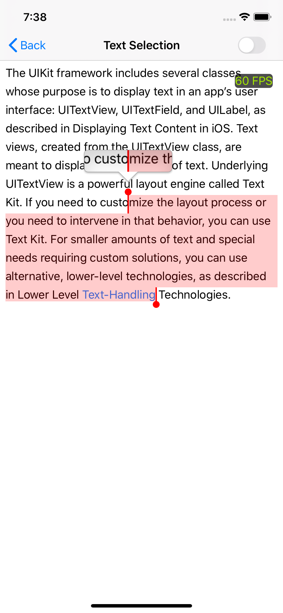

# MPITextKit

[](https://github.com/meitu/MPITextKit/actions?query=workflow%3Abuild)&nbsp;
[](https://raw.githubusercontent.com/MPITextKit/master/LICENSE)&nbsp;
[](http://cocoapods.org/pods/MPITextKit)&nbsp;
[](https://github.com/Carthage/Carthage)&nbsp;
[](https://swift.org/package-manager)&nbsp;
[](http://cocoadocs.org/docsets/MPITextKit)&nbsp;
[](https://www.apple.com/nl/ios/)&nbsp;

Powerful text framework for iOS to display rich text based on TextKit, inspired by [Texture](https://github.com/texturegroup/texture) and [YYText](https://github.com/ibireme/YYText).

<p align="left">
    
    
    
    
    
    
</p>

## Features

- UILabel API compatible
- AutoLayout supported
- Renders using TextKit, so handles all the text attributes. eg. NSAttachmentAttributeName, NSStrikethroughStyleAttributeName, NSUnderlineStyleAttributeName etc.
- High performance asynchronous text layout and rendering
- Text attachments with UIImage, UIView and CALayer
- Exclusion paths 
- Custom attributes
- Custom truncation token 
- Debug text layout 
- Text selection 

## Requirements

- iOS 10+

## Installation

MPITextKit supports multiple methods for installing the library in a project.


### Installation with CocoaPods

```
pod 'MPITextKit'
```

### Installation with Swift Package Manager

Once you have your Swift package set up, adding MPITextKit as a dependency is as easy as adding it to the `dependencies` value of your `Package.swift`.

```swift
dependencies: [
    .package(url: "https://github.com/meitu/MPITextKit.git")
]
```

### Installation with Carthage

[Carthage](https://github.com/Carthage/Carthage) is a decentralized dependency manager that builds your dependencies and provides you with binary frameworks. To integrate MPITextKit, add the following to your `Cartfile`.

```ogdl
github "meitu/MPITextKit"
```

## Usage

### Basic

```objc
MPILabel *label = [MPILabel new];
label.text = @"foo";
label.font = [UIFont systemFontOfSize:16];
label.textAlignment = NSTextAlignmentCenter;
label.textVerticalAlignment = MPITextVerticalAlignmentTop;
label.textColor = [UIColor whiteColor];
label.textContainerInset = UIEdgeInsetsMake(8, 8, 8, 8);
```

### Attributed Text

```objc
NSMutableAttributedString *attributedText = [[NSMutableAttributedString alloc] initWithString:@"bar"];
    
// Append Attachment.
MPITextAttachment *attachment = [MPITextAttachment new];
attachment.content = [UIImage imageNamed:@"img"];
attachment.verticalAligment = MPITextVerticalAlignmentCenter;
NSAttributedString *attachmetText = [NSAttributedString attributedStringWithAttachment:attachment];
[text appendAttributedString:attachmetText];
    
MPILabel *label = [MPILabel new];
label.numberOfLines = 0;
label.delegate = self; /// Interact Links.

label.attributedText = attributedText;

// Truncation Token ...
label.truncationAttributedToken = MPITextDefaultTruncationAttributedToken(); 

// Additional Truncation Message.
label.additionalTruncationAttributedMessage = [[NSAttributedString alloc] initWithString:@"more" attributes:@{NSForegroundColorAttributeName: [UIColor colorWithRed:0.000 green:0.449 blue:1.000 alpha:1.000], MPITextLinkAttributeName: [MPITextLink new]}];

[label sizeToFit];
label.center = self.view.center;
[self.view addSubview:label];
```

### Size Calculation

```objc
NSAttributedString *attributedText = [[NSAttributedString alloc] initWithString:text attributes:@{NSFontAttributeName: [UIFont preferredFontForTextStyle:UIFontTextStyleBody]}];
NSAttributedString *token = MPITextDefaultTruncationAttributedToken();
NSAttributedString *additionalMessage =
[[NSAttributedString alloc] initWithString:@"more" attributes:@{NSForegroundColorAttributeName: [UIColor colorWithRed:0.000 green:0.449 blue:1.000 alpha:1.000], MPITextLinkAttributeName: [MPITextLink new]}];
NSAttributedString *truncationAttriubtedText = MPITextTruncationAttributedTextWithTokenAndAdditionalMessage(attributedText, token, additionalMessage);
CGSize fitsSize = CGSizeMake(CGRectGetWidth(self.view.frame) - 30, CGFLOAT_MAX);
// You can change it for testing
NSUInteger numberOfLines = 5;
    
MPITextRenderAttributes *renderAttributes = [MPITextRenderAttributes new];
renderAttributes.attributedText = attributedText;
renderAttributes.truncationAttributedText = truncationAttriubtedText;
renderAttributes.maximumNumberOfLines = numberOfLines;
// Result of calculation, you can use it do something.
CGSize textSize = MPITextSuggestFrameSizeForAttributes(renderAttributes, fitsSize, UIEdgeInsetsZero);
```

## Debug

```objc
MPITextDebugOption *debugOptions = [MPITextDebugOption new];
debugOptions.baselineColor = [[UIColor redColor] colorWithAlphaComponent:0.5];
debugOptions.lineFragmentBorderColor = [[UIColor redColor] colorWithAlphaComponent:0.200];
debugOptions.lineFragmentUsedBorderColor = [UIColor colorWithRed:0.000 green:0.463 blue:1.000 alpha:0.200];
debugOptions.glyphBorderColor = [UIColor colorWithRed:1.000 green:0.524 blue:0.000 alpha:0.200];
[MPITextDebugOption setSharedDebugOption:debugOptions];
```

## Notice

- For multi-line text display in AutoLayout, it is recommended to set the `preferredMaxLayoutWidth` to improve performance.
- You should not use `text` and `attributedText` at the same time.
- When you customize attribute, you should override the  `- isEqual:` and  `- hash` methods.

## Reference

- [Texture](https://github.com/texturegroup/texture): Smooth asynchronous user interfaces for iOS apps.
- [YYText](https://github.com/ibireme/YYText): Powerful text framework for iOS to display and edit rich text.
- [STULabel](https://github.com/stephan-tolksdorf/STULabel): A faster and more flexible label view for iOS.
- [Neat](https://github.com/leavez/Neat): Fix the line height problems of TextKit.
- [Cocoa text system](https://juejin.im/post/5cceef41e51d4514df42072b): Introduction to cocoa text system.

## License

`MPITextKit` is released under the MIT license. See [LICENSE](./LICENSE) file for details.


